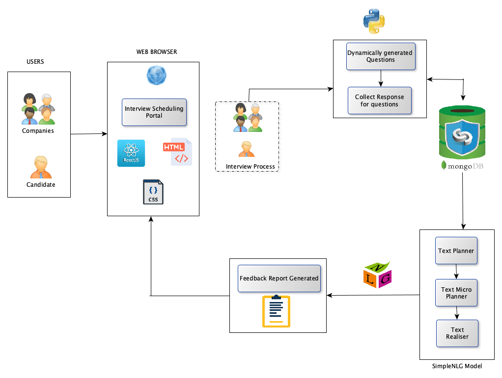
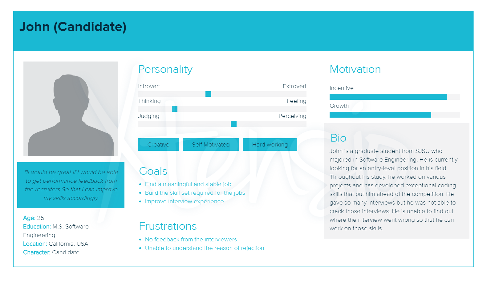
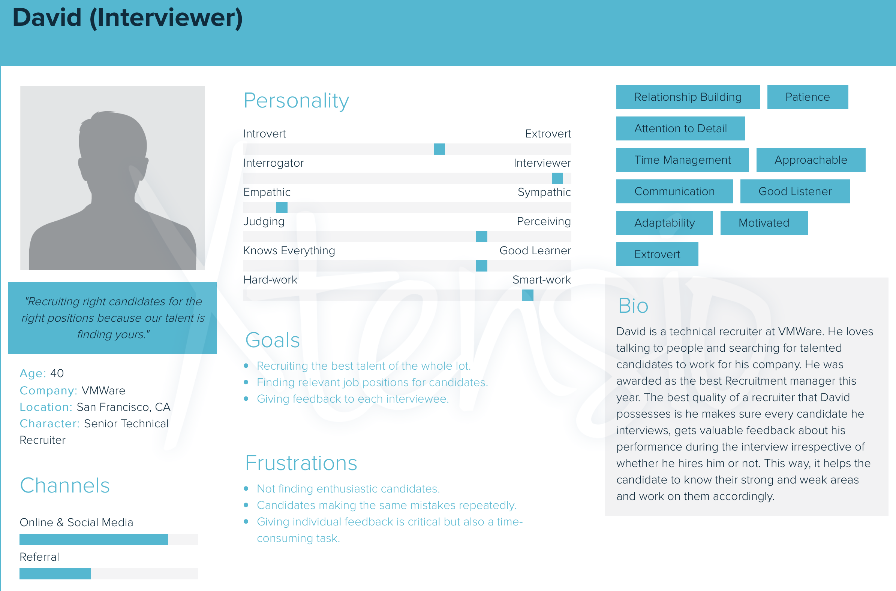

# Feed-Me-Back

# ABSTRACT 
Everyday thousands of people struggle to find the right job because of which they appear for several rounds of interviews. After going through a hectic process of technical and HR inteviews, many get rejections by the end of the day. Rejection leads to a situation where candidates question their skills and abilities. The Feed-Me-Back web portal will be designed to help such candidates to get a performance feedback report at the end of the day to know what went wrong with interview process. The report will reflect on skills that person could improve on so that they will be well prepared for other upcoming interviews. In the web portal, startup companies can schedule an interview for the candidate and after the interview, interviewers can provide their response to survey questions which will be dynamically generated based on resume and job requirements. Based on the feedback response, we will generate a performance report which will be analyzed in aggregate for a user using Natural language Generation.

# ARCHITECTURE DIAGRAM

# TARGET USERS
Consider a startup company Cohesity who wants to hire someone for the position of Product Manager. The HR of the Cohesity company schedules an interview using the Feed-Me-Back scheduler web application for a candidate named John.

John is interested in this position and uses the Feed-Me-Back scheduler to check interview details that is scheduled on 3rd November 2019 at 10:00 am. 

After John goes through 4 rounds of interview, each interviewer will login to the application portal and will get a survey to fill for John. 

Later, when John will login to the scheduler application he will get a report that will contain his aggregated feedback of all interviews. 

# Design Thinking

<b>Candidate</b>

who: Candidate

what: can schedule interview 

wow : gets the detail report of the interview

<b>Interviewer</b>

who: Interviewer

what: interviews candidates and provides feedback

wow: within few seconds just by selecting answers to few questions and not writing whole paragraphs.

  
# TECHNOLOGY STACK
Machine Learning Model : Natural Language Generation using SimpleNLG  
Programming Languages : Java, Python  
Database : MongoDB  
Web Development : ReactJS, HTML, CSS  
Service : AWS

# Feedback
Professor Ranjan's Feedback:

I would rather make it an interview preparation app where interview will be scheduled and interviewer will provide feedback which will be analyzed in aggregate for a user. Even survey questions for interviewer should be dynamically generated based on resume and job requirements.
